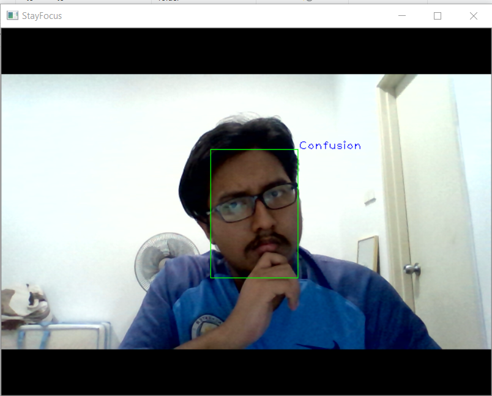
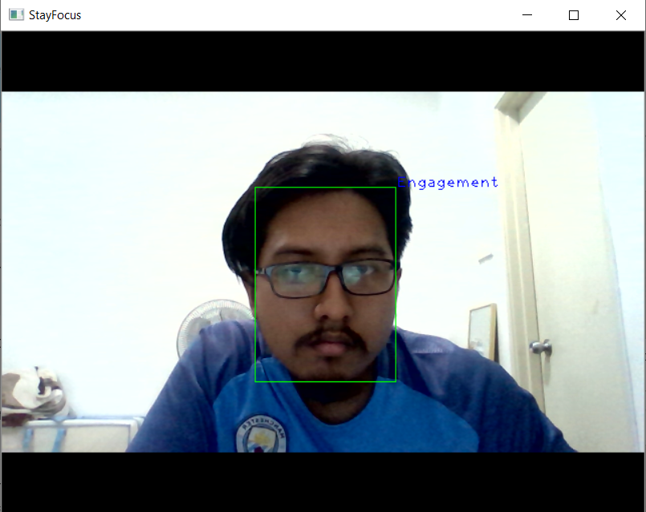
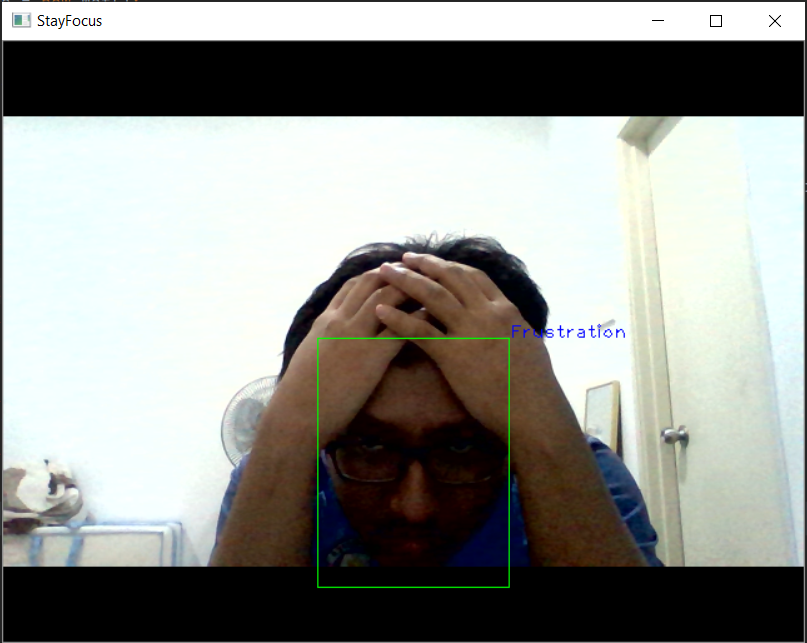

#_**StayFocus**_
##Engagement Detection of Students during Online Learning
###A. Name of project
**StayFocus**

###B. Description of the project
####i. Example Detection
- Boredom:


- Confusion:



- Engagement:



- Frustration:



####ii. Input and output information
- **Input:** Webcam as video input
- **Output:** Classification (emotion) with Localization (bounding box)

###C. Motivation of the idea
- Currently, there are a lot of online learning done by schools and universities due to the pandemic. Therefore, we think by doing this project, it will help the teachers monitor the students of their engagement during the lessons.
- This project also our CDLE capstone project.

###D. Data Set Sources
- **Dataset**: DAiSEE dataset. The dataset can be download [here](https://iith.ac.in/~daisee-dataset/).

```
A Gupta, A DCunha, K Awasthi, V Balasubramanian
DAiSEE: Towards User Engagement Recognition in the Wild
arXiv preprint: arXiv:1609.01885
```
- 4 classes :
    - Boredom
    - Confusion
    - Engagement
    - Frustration

###E. Network Description
- Pretrained model: VGG 16
- Fine tuning: fc2, predictions layer

###F. Model Training
- Train for 20 epochs on CPU (i5 9th gen).
- Sample frames of 10 videos from DAiSEE dataset
- Duration: ~3 hours
- Accuracy: 73.51%

###G. Testing
- Sample frames of 2 videos from DAiSEE dataset
- Accuracy: 78.94%

###H. Future Development
- Gesture Detection
    - To include body gesture into the model
- Support Message
    - To give a message to student to regain focus in the lesson
- Engagement Gauge
    - To give feedbacks to teachers about the students' focus level

###I. Contact information
- Atiff Zakwan, atiffzakwan@gmail.com
- Soo Wan Yong, wanyong_soo@hotmail.com

###J. List of Group members
- Atiff Zakwan
- Soo Wan Yong
